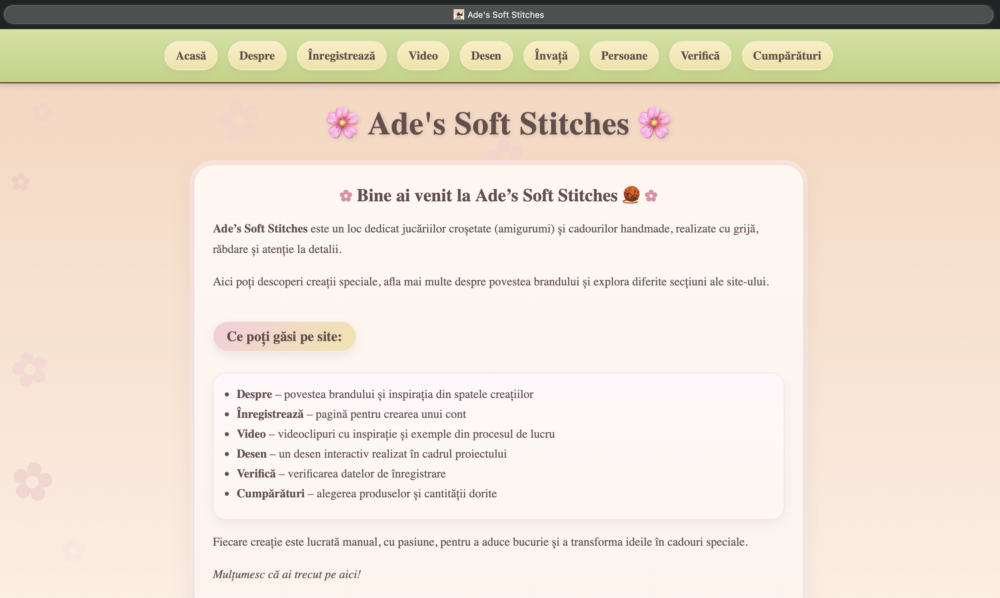
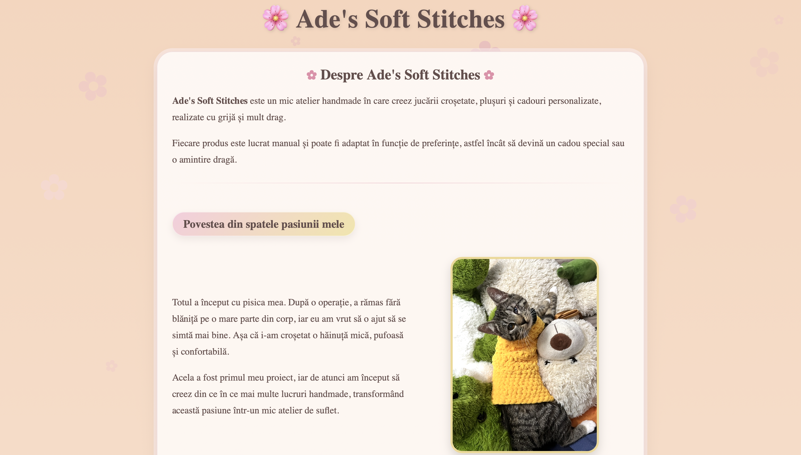
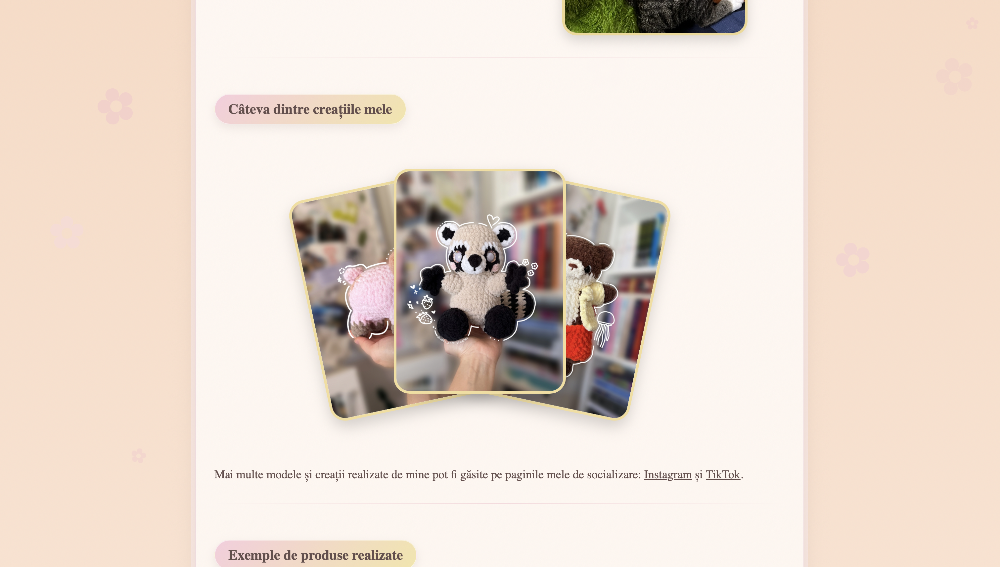
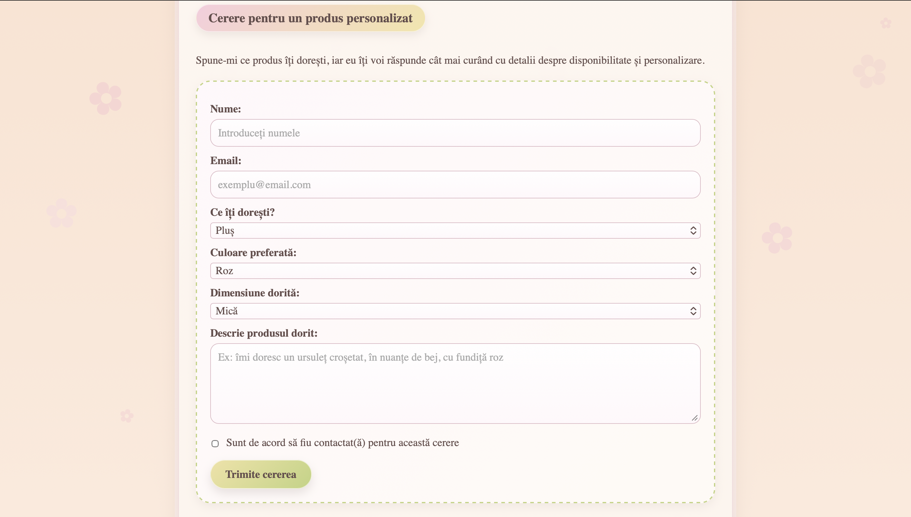
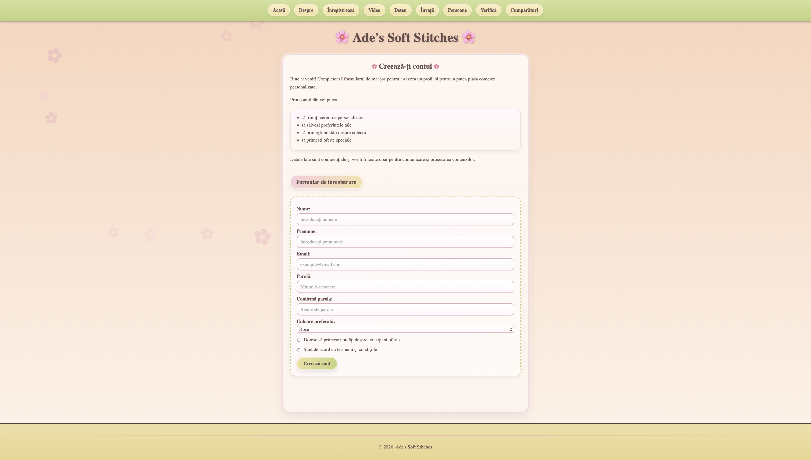
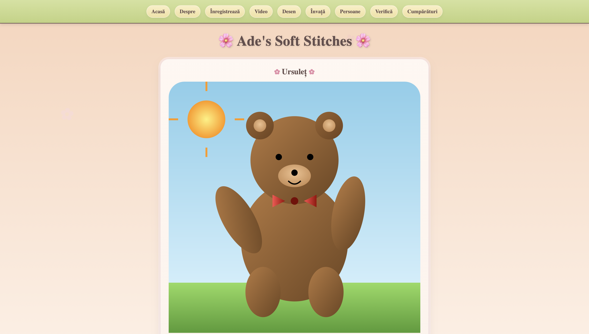
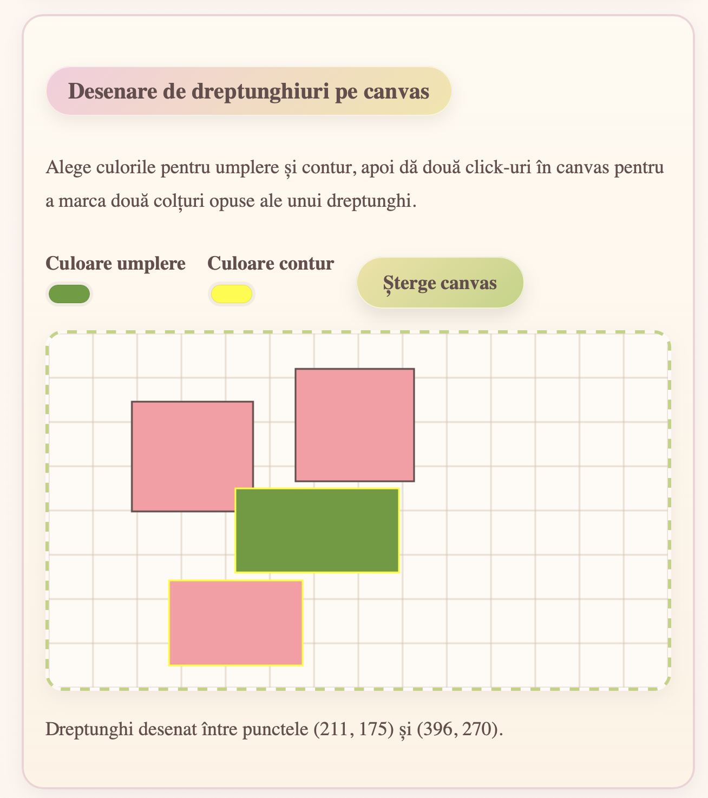
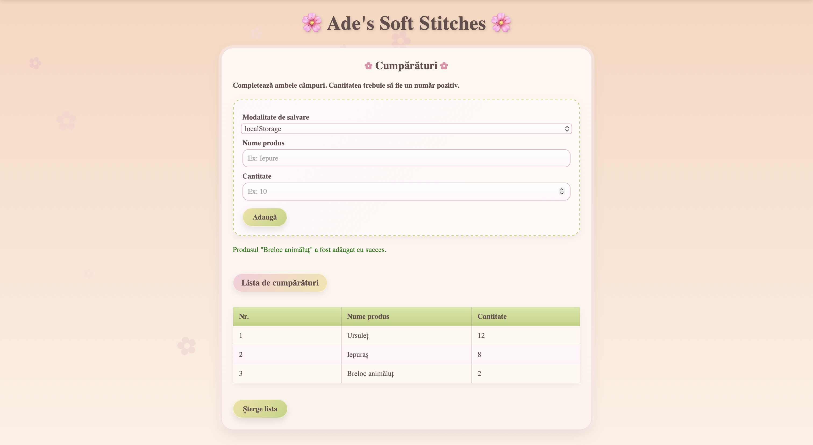

<div align="center">

# 🌸 Ade’s Soft Stitches 🧶

### A cozy handmade-brand web experience for crochet creations, amigurumi and personalized gifts

A soft and playful website inspired by a real creative journey — from the first tiny handmade project to a growing collection of personalized crochet creations.

<br>



<br>


</div>

---

## ✨ About the Project

**Ade’s Soft Stitches** is a web application created around my handmade crochet brand. It introduces the story behind the workshop, presents a selection of handmade creations and gives visitors a warm, friendly space where they can explore personalized gift ideas.

The project combines a real small-business identity with fundamental web-development concepts. Its interface uses pastel colors, rounded cards, floral decorations and handcrafted-product photography to reflect the cozy personality of the brand.

The website content is written in Romanian because it was designed for the brand’s local audience.

---

## 💗 A Project Close to My Heart

This website is more than a programming assignment. It brings together two important parts of my life: software development and my handmade business.

Every section was designed to reflect the gentle and playful identity of **Ade’s Soft Stitches** — a small creative space built around patience, imagination and carefully crafted details.

<div align="center">
  
</div>

---

## 🧸 Handmade Creations

The website includes a visual gallery dedicated to crochet creations and amigurumi characters. The gallery presents the personality of the brand through colorful handmade products, soft textures and playful designs.

<div align="center">
  
</div>

---

## 💌 Personalized Product Requests

Visitors can submit a custom-product request directly from the website.

The form allows them to choose:

* the preferred product category;
* a color palette;
* the desired size;
* additional details for the handmade creation;
* permission to be contacted about the request.

The data is sent asynchronously to the custom Python server and stored locally in JSON format.

<div align="center">
  
</div>

---

## 🎀 Main Features

### Brand presentation

* Handmade workshop story
* Soft pastel visual identity
* Decorative floral background
* Crochet and amigurumi gallery
* Embedded social-media content
* Video and inspiration sections

### Forms and asynchronous requests

* Account-registration form
* Personalized-product request form
* Client-side validation
* JSON-based local data storage
* Asynchronous communication using `XMLHttpRequest`

### Interactive learning modules

* Animated SVG teddy-bear illustration
* Canvas drawing activity with customizable colors
* Dynamic HTML table manipulation
* Browser, URL, operating-system and date information
* XML and DTD resources
* Web Worker usage
* Shopping-list persistence using `localStorage` and `IndexedDB`

---

## 🌷 Account Registration

The account-registration section introduces a friendly onboarding experience for visitors who want to create a profile and explore personalized handmade products.

The form includes:

* name and surname fields;
* email validation;
* password confirmation;
* favorite-color selection;
* newsletter preferences;
* terms-and-conditions confirmation.

<div align="center">
  
</div>

---

## 🧸 Animated SVG Illustration

The project includes a playful SVG teddy-bear illustration created directly in HTML.

This section demonstrates:

* vector shapes;
* gradients;
* SVG grouping;
* simple animations;
* visual composition without external image assets.

<div align="center">
  
</div>

---

## 🎨 Interactive Canvas Laboratory

The learning area contains an interactive drawing laboratory.

Visitors can:

1. choose a fill color;
2. choose an outline color;
3. click two opposite points on the canvas;
4. generate custom rectangles;
5. clear the canvas and try again.

<div align="center">
  
</div>

---

## 🛍️ Shopping List Demo

The shopping-list module demonstrates two browser-storage solutions:

* `localStorage`
* `IndexedDB`

Visitors can choose a storage method, add products with quantities and clear the saved list.

<div align="center">
  
</div>

---

## 🛠️ Technical Overview

The application is built without external frameworks in order to demonstrate core web-development concepts directly.

| Area               | Technologies and concepts                                                  |
| ------------------ | -------------------------------------------------------------------------- |
| Frontend structure | HTML5 and reusable page sections                                           |
| Styling            | CSS3, responsive layouts, gradients, transitions and animations            |
| Client-side logic  | Vanilla JavaScript                                                         |
| Dynamic navigation | Asynchronous HTML loading with `XMLHttpRequest`                            |
| Data formats       | JSON, XML and DTD                                                          |
| Browser APIs       | Canvas API, SVG, Web Workers, `localStorage` and `IndexedDB`               |
| Backend            | Custom Python socket-based HTTP server                                     |
| Server behavior    | Static-file serving, POST request handling, threading and gzip compression |

---

## 🧵 Project Structure

```text
ades-soft-stitches-web/
├── README.md
├── .gitignore
├── screenshots/
│   ├── 01-home-page.png
│   ├── 02-brand-story.png
│   ├── 03-handmade-gallery.png
│   ├── 04-custom-order-form.png
│   ├── 05-registration-form.png
│   ├── 06-svg-bear.png
│   ├── 07-interactive-canvas.png
│   └── 08-shopping-list.png
├── continut/
│   ├── index.html
│   ├── acasa.html
│   ├── despre.html
│   ├── inregistreaza.html
│   ├── desen.html
│   ├── invat.html
│   ├── cumparaturi.html
│   ├── css/
│   ├── js/
│   ├── imagini/
│   └── resurse/
└── server_web/
    ├── server_web.py
    └── lanseaza_server.sh
```

---

## 🚀 Run the Project Locally

### Requirements

* Python 3
* A modern web browser

### Start the custom HTTP server

```bash
cd server_web
python3 server_web.py
```

Open the application in your browser:

```text
http://localhost:8888
```

To stop the server, return to the terminal and press:

```text
Control + C
```

---

## 🔒 Privacy Note

This repository is intended as a portfolio and educational project.

Local JSON files containing submitted product requests or user credentials are excluded from version control. The registration system is a learning prototype and is not intended for production use.

Sensitive information should never be committed to a public repository.

---

## 🌼 What I Learned

This project allowed me to connect a real handmade brand with a wide range of web-development concepts:

* structuring a multi-section web application;
* creating a cohesive responsive interface;
* building a visual identity around a small business;
* loading content dynamically without reloading the entire page;
* designing and validating HTML forms;
* sending asynchronous requests;
* working with JSON, XML and DTD resources;
* using Canvas, SVG and Web Workers;
* storing information through browser APIs;
* implementing a lightweight HTTP server with Python sockets;
* serving static files with correct content types;
* handling POST requests;
* applying gzip compression;
* processing concurrent requests with threads.

---

## 💗 Brand Links

Follow **Ade’s Soft Stitches** for more handmade creations:

* [Instagram](https://www.instagram.com/ades_soft_stitches/)
* [TikTok](https://www.tiktok.com/@ades_soft_stitches)

---

<div align="center">

### Made with yarn, patience and a little bit of code 🧶🌸

</div>
